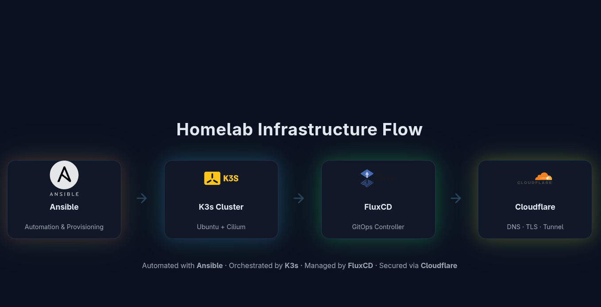
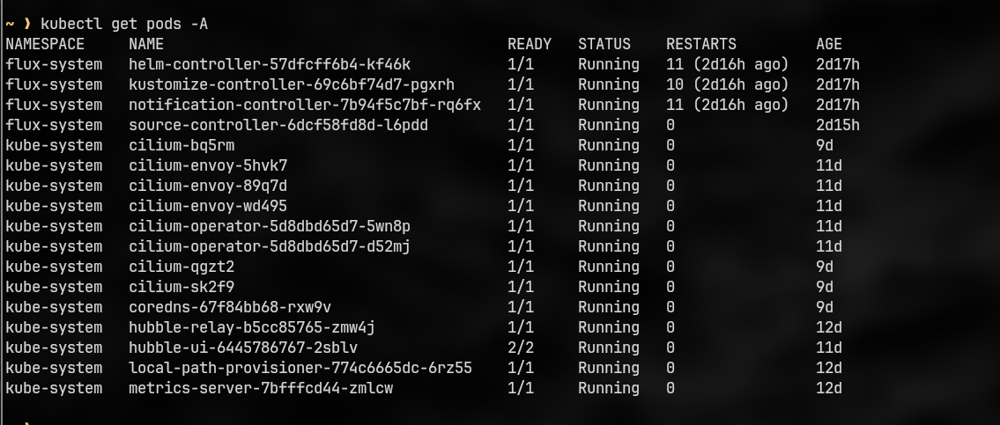

# 🧩 homelab-infra

[](https://github.com/cchacon-dev/homelab-infra/actions/workflows/lint.yml)
[](#)
[](#)
[](#)
[](#)

Infrastructure-as-Code (IaC) project to bootstrap a **bare-metal homelab** using **Ubuntu Server, Ansible, K3s, Cilium, and FluxCD**.
The goal is to let **anyone** spin up a production-like Kubernetes environment on physical nodes — fully automated and reproducible.

> 🧠 This is my **first Ansible project**, built as part of my DevOps learning journey and personal portfolio.
> Designed to be **simple, readable, and educational**, while following best practices in modularity and idempotency.

---

## ✨ Features

- ✅ **Idempotent** — safe to re-run anytime
- 🧱 **Role-based structure** (`base`, `k3s`, `cilium`, `gitops`)
- 🗂️ **Inventory per environment** (`ansible/inventory/prod`)
- 🔐 **Ansible Vault** ready for secrets
- 🕸️ **Cilium** as the Kubernetes CNI
- 🌀 **FluxCD** preinstalled and syncing against a private GitOps repository
- 🧪 *Molecule* was removed for faster iteration but can be re-added later
- 🧹 **Linting ready** with `ansible-lint`, `yamllint`, and `pre-commit`

---

## 🧭 Architecture Overview

```
Ubuntu nodes ──(Ansible)──> K3s cluster
                         └──> Cilium CNI
                         └──> FluxCD (GitOps) ──> private GitOps repo (manifests)
```

After provisioning, all cluster state and applications can be managed declaratively via GitOps.

## 📸 Screenshots

| Homelab Overview | Cluster Ready | Flux Sync |
|------------------|---------------|------------|
|  |  |  |

---

## ⚙️ Requirements

- One or more **Ubuntu Server** nodes (control-plane + workers) accessible via SSH
- A control machine with **Ansible ≥ 2.15** and `kubectl`
- SSH keys exchanged between controller and nodes
- Variables filled in `ansible/inventory/prod/group_vars/all/main.yml` (IPs, CIDRs, versions, etc.)
- (Optional) `ansible-vault` configured for secrets

---

## 🚀 Quickstart

1. **Clone this repo** and configure inventory and variables:

   ```bash
   cp -r ansible/inventory/prod ansible/inventory/local   # optional
   $EDITOR ansible/inventory/prod/hosts.ini
   $EDITOR ansible/inventory/prod/group_vars/all/main.yml
   ```

2. **Check connectivity**

   ```bash
   ansible -i ansible/inventory/prod/hosts.ini all -m ping
   ```

3. **Deploy step by step**

   ```bash
   ansible-playbook -i ansible/inventory/prod/hosts.ini ansible/site.yml --tags base
   ansible-playbook -i ansible/inventory/prod/hosts.ini ansible/site.yml --tags k3s
   ansible-playbook -i ansible/inventory/prod/hosts.ini ansible/site.yml --tags cilium
   ansible-playbook -i ansible/inventory/prod/hosts.ini ansible/site.yml --tags gitops
   ```

4. **Validate the cluster**

   ```bash
   kubectl get nodes -o wide
   kubectl -n flux-system get kustomizations,gitrepositories
   ```

---

## 🗃️ Repository Layout

```
ansible/
  ansible.cfg
  site.yml
  inventory/
    prod/
      hosts.ini
      group_vars/
        all/
          main.yml
          vault.yml        # encrypted secrets
  roles/
    base/
      defaults/ handlers/ tasks/ templates/
    k3s/
      defaults/ tasks/
    cilium/
      defaults/ tasks/
    gitops/
      defaults/ tasks/
```

---

## 🌐 Ingress / Gateway Options

Choose what fits your environment best (defined later in your GitOps manifests):

| Type | Recommended Tools | Notes |
|------|-------------------|-------|
| **Standard Route** | Ingress-NGINX, ExternalDNS, cert-manager | Classic setup. Works great with **Cloudflare** for automatic DNS + TLS (DNS-01 solver). |
| **Zero-Trust Route** | Cloudflare Tunnel (`cloudflared`) + your Ingress/Gateway | Expose internal services to the Internet without open ports — great for homelabs behind NAT. |

> Both setups can coexist.
> Start with the **Ingress-NGINX + ExternalDNS + cert-manager** combo, then explore Cloudflare Tunnels as an advanced layer.

---

## 👤 Author

> **Carlos Chacon** — Senior software developer & DevOps enthusiast.
> This project documents my hands-on journey into Infrastructure as Code and GitOps automation.

- GitHub Infra: https://github.com/cchacon-dev/homelab-infra
- GitOps repo: Private (Preparing and gitops starter)

---

## 📝 License

MIT License © 2025 Carlos
